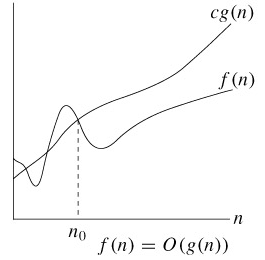

---

layout: post
class: post-template
navigation: true
title: "2. 복잡도"
date: 2021-06-10 23:00:09
categories: CS/DataStructure
use_math: true
---
<br>

인간은 유한한 삶을 가진 존재이기에 항상 `finite amount of space and time`에 집중해야한다.
알고리즘은 **유한한** 자원을 가진 환경에서 주어진 문제를 푸는 동작의 집합이고 적은 시간과 적은 자원(공간)을 이용해 문제를 해결하는 알고리즘이 좋은 알고리즘이다.


**좋은 프로그램의 3가지 기준**
1. 정확하게 잘 작동하는가?
2. 이해하고 수정하기 쉬운가?
3. 효율적인가?


컴퓨터 성능의 발전에 따라 공간복잡도보다는 시간복잡도가 더 중요한 이슈가 되었다. 따라서 여기서는 시간복잡도에 대해서만 알아볼 것이다.


<br>
<br>


## 시간복잡도

알고리즘이 문제를 해결하기 위한 **`시간(연산)의 횟수`**를 말한다.

연산 횟수를 카운팅 할때 3가지 경우가 있다.

1. 최선의 경우 Best Case
2. 최악의 경우 Worst Case
3. 평균적인 경우 Average Case

평균적인 경우가 가장 이상적으로 보이겠지만 알고리즘이 복잡해 질수록 평균적인 경우는 구하기가 매우 어려워 진다. 그러므로 **최악의 경우**로 알고리즘의 성능을 파악한다.


<br>

### Elementary Operation

: 프로그램의 진행 정도를 나타내는 기본 단위이다.

1. 대입연산
2. 덧셈, 뺄셈, 곱셈, 나눗셈
3. 비교구문
4. 함수호출

즉, 알고리즘의 실행 순서를 따라가며 Elementary Operation이 일어나는 수를 측정한다.


<br>

**Counting**

- 전역변수를 이용하여 Elementary Operation을 카운팅한다.

```javascript
let count = 0;
function sum(list, n) {
  let tempSum = 0; // 대입연산

  for (let i = 0; i < n; i++) {
    count++;   // loop 한번 돌 때마다
    tempSum += list[i];
    count++;  // 대입연산
  }
  count++;  // for loop 끝날 때 한번
  count++;  // return 수행
  return tempSum;
}
```


- 각 실행문 별로 Step수와 실행 횟수를 분석한다.

  


<br>

**주어진 프로그램 2개의 성능 비교 및 분석**

```
프로그램 P1의 성능 : C1 * n^2 + C2 * n
프로그램 P2의 성능 : C3 * n
```

C1, C2, C3의 대소에 따라 결과가 다르다. 어떤 C1, C2, C3에 대해서도 C1 * n^2 > C3 * n을 만족하는 n은 존재한다. 

따라서 n이 작은 경우 모두 성능이 좋으므로 문제될 것은 없지만 그래도 프로그램 P1의 성능이 더 좋고, n이 충분히 크면 항상 프로그램 P2의 성능이 좋다. (P1에는 n이 제곱이기 때문에)

**따라서 n이 큰 경우의 처리가 중요하다.**


<br>


### Asymptotic Complexity

입력의 크기가 충분히 클 때의 `시간복잡도`와 `공간복잡도`를 분석하는 것.

- 프로그램의 입력 크기 등 성능을 결정하는 주요 특성 값이 매우 클 때의 프로그램의 성능.
- 프로그램의 실행 속도가 어떤 경향을 가지는지를 평가한다고 생각하면 된다.
- ex. 입력의 크기가 n이고 n이 매우 큰 경우
- 프로그램 성능 평가의 매우 중요한 기준

<br>

#### 점근적 분석의 필요성

어떠한 문제 해결을 위한 알고리즘의 성능분석을 할 때, 주어지는 데이터의 형태나 실험을 수행하는 환경, 또는 실험에 사용한 시스템의 성능등 다양한 요소에 의해 공평한 결과가 나오기 힘들고 비교 결과가 항상 일정하지 않을 수 있다.

 이를 효과적으로 해결하는 방법이 점근적 분석법이다. 점근적 분석법은 각 알고리즘이 주어진 데이터의 크기를 기준으로 수행시간 혹은 사용공간이 얼마나 되는지를 **객관적으로 비교할 수 있는 기준을 제시**해 준다.

O(빅오), Ω(오메가), Θ(세타)등이 있다. 일반적으로 빅오와 세타표기가 많이 사용된다.

<br>

#### 빅오 표기법 O Notation

$ O(g(n)) = f(n) $: There exist postivie constants $c$ and $n_0$ such that $ 0 \leq f(n) \leq c*g(n) $ for all $ n \geq n_0 $

- 점근적 상한선 (Asymptotic upper bound)
- 주어진 알고리즘이 아무리 나빠도 비교하는 함수와 같거나 좋다.
- 일반적으로 가장 많이 사용하는 Asympototic time complexity이다.




$n_0$보다 큰 모든 $n$값에 대해 함수값 $f(n)$은 함수 $c*g(n)$보다 작거나 같다는 의미이다. 

$ T(n) = n^2 + 2n + 9 = O(n^2) $

$ T(n) = n^4 + n^3 + n^2 + 1 = O(n^4) $

$ T(n) = 5n^3 + 3n^2 + 2n + 1 = O(n^3) $


위 예시들과 같이 $ T(n) $ 으로 표현한 함수의 **최고차항의 차수**가 빅오가 된다.
빅오의 순서는 아래와 같고 커질수록 좋지 않다. 보통 O(n<sup>2</sup>)이상의 복잡도를 가지는 알고리즘은 좋지 않다.


$ O(1) < O(logn) < O(n) < O(nlogn) < O(n^2) < O(n^3) < O(2^n) < O(n!) $


<br>


#### 오메가 표기법 Ω Notation

$ \Omega (g(n)) = f(n) $ : there exist positive constants $c$ and $n_0$ such that $ 0 ≤ c*g(n) ≤ f(n) $ for all $n ≥ n_0$

- 점근적 하한선 (Asymptotic lower bound)

- 주어진 알고리즘이 아무리 좋아도 비교하는 함수와 같거나 나쁘다.

  


$n_0$보다 큰 모든 $n$값에 대해 함수값 $f(n)$은 함수값 $c*g(n)$보다 크거나 같다는 의미이다.


$ T(n) = n^2 + 2n + 9 = \Omega(n^3) $

$ T(n) = n^4 + n^3 + n^2 + 1 = \Omega (n^5) $

$ T(n) = 5n^3 + 3n^2 + 2n + 1 = \Omega (n^4) $


<br>


#### 세타 표기법 Θ Notation

$ \theta (g(n)) = f(n) $ : there exist positive constants $c_1,\ c_2$ and $n_0$ such that $ 0  \leq c_1*g(n) \leq f(n) \leq c_2 * g(n)$ for all $n\geq n_0$

- 점근선 상한선과 점근적 하한선의 교집합 (Asymptotic tighter bound)

- 주어진 알고리즘이 아무리 좋아지거나 나빠지더라도 비교하는 함수의 범위안에 있다.

  

  

$n_0$보다 큰 모든 $n$값에 대해 함수값 $f(n)$은 함수값 $c_1*g(n)$보다 크거나 같거나 $c_2*g(n)$보다 작거나 같다는 의미이다.


$ T(n) = n^2 + 2n + 9 = \theta (n^2) $

$ T(n) = n^4 + n^3 + n^2 + 1 = \theta(n^4) $

$ T(n) = 5n^3 + 3n^2 + 2n + 1 = \theta(n^3) $

