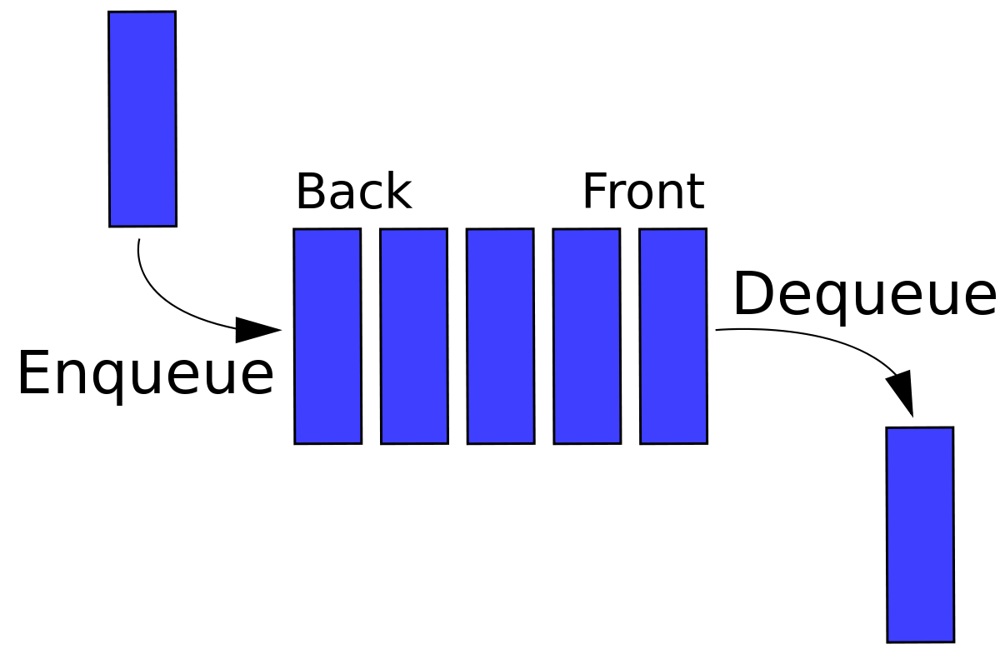

기존의 큐는 입출구가 한개 였지만 deque는 입출구가 두개인 큐입니다. Double-ended Queue (deque)이라고도 합니다.

<br>





기존의 큐는 입출구가 한개 였지만 deque는 입출구가 두개인 큐입니다.

스택과 큐를 합쳐놓은 형태라고 생각하면 편합니다.


**STL deque**

```c++
#include <deque>

std::deque <int> deq;
```


STL deque의 저장공간은 필요에 따라 자동으로 확장 및 축소됩니다.

- deque의 확장은 기존 요소를 새 메모리 위치로 복사하는 것을 포함하지 않기 때문에 `vector`의 확장보다 가볍습니다.
- STL deque는 linked list가 아니라 블록 또는 데이터 배열에 대한 포인터 배열로 구현됩니다. 블록 수는 스토리지 요구 사항에 따라 동적으로 변경되고 포인터 배열의 크기는 그에 따라 변경됩니다.
- deque에 대한 시간복잡도.
  - 랜덤 액세스 - O(1)
  - 처음 또는 마지막에 요소 삽입 또는 제거 - O(1)
  - 중간에 요소 삽입 또는 제거 - O(n)


### 라이브러리

```c++
void push_back();
void push_front();
void insert();
int pop_back();
int pop_front();
void empty();
int size();
```


#### 헤더파일

```c++
#include <deque>
```


#### 테스트

```c++
#include <deque>

using namespace std;

int main() {
    
}
```


덱에 대한 내용이 많지 않기 때문에 깊게 다루지 않겠습니다.
