첫 번째 노드를 가진 링크드 가 있는 linked list와 같으며 첫 번째 노드를 트리의 루트라고합니다.


트리란 루트 (첫 번째 노드)를 가진 연결리스트입니다.

트리의 세부사항과 종류를 알아봅시다.

<br>

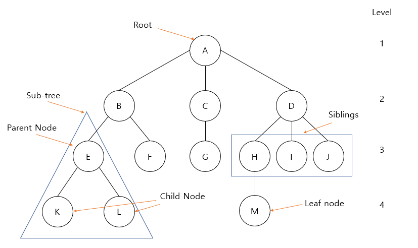


**용어**

- node: 위의 그림에서 동그라미

- edge: 위의 그림에서 선

- level: 트리의 특정 깊이를 가지는 노드의 집합

- leaf nodes( =internal nodes): 자식을 갖지 않는 노드를 말합니다.

- height(=depth): 트리의 깊이

- root: 가장 상위에 위치한 노드

- degree: 노드가 지닌 자식의 갯수

  


**특징**

- 그래프의 한 종류, ‘최소 연결 트리’ 라고도 불린다.

  => 두 개의 정점 사이에 반드시 1개의 경로만을 가진다.

  

- 계층 모델

- 트리는 DAG (Directed Acyclic Graphs, 방향성이 있는 비순환 그래프)의 한 종류

  => loop나 circuit이 없다. 당연히 self-loop도 없다.

  

- 노드가 N개인 트리는 항상 N-1개의 간선(edge)을 가진다.
  => 간선은 항상 (정점의 개수 - 1) 만큼을 가진다.


### Binary Tree

각 노드에 left child 혹은 right child가 있는 트리입니다.

```c
typedef struct node{
    int item;
    pTree left;
    pTree right;
}node;

typedef struct node *pTree;
```


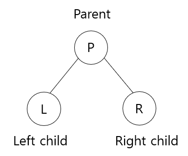


 

즉 아래의 트리들도 binary tree 입니다.

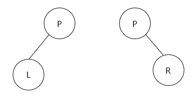  


#### Binary Tree in Memory

- Left child ($i$) = $2i$
- Right child ($i$) = $2i + 1$
- Parent(i) = $ \lfloor i / 2 \rfloor $  

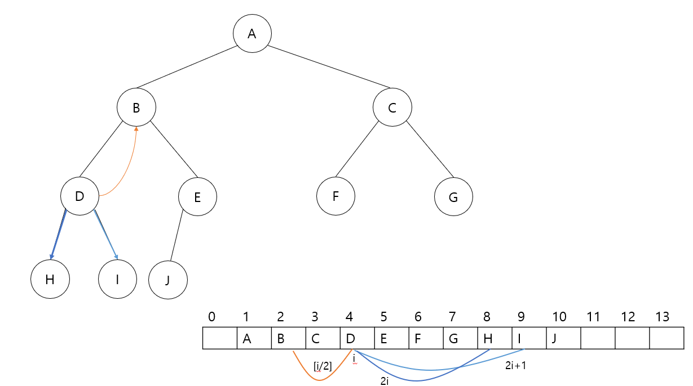


**한계점**

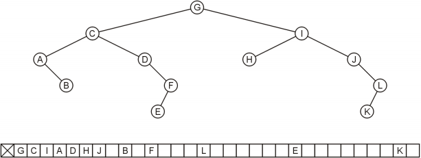

이 트리는 12개의 노드를 가지고 있으며 32개의 요소를 배열해야 한다. 

노드 K의 자식으로 노드 하나를 추가하면 배열에 필요한 메모리가 두 배로 증가합니다.

최악의 경우 깊이 $k$의 기울어진 트리는 $O(2^k)$인 $2^k – 1$ 공간이 필요하지만 그 중 $k$만 사용하게 됩니다.


 


### Full Binary Tree

: depth가 $k$ 일 때, 총 노드의 갯수가 $ 2^k -1$ 인 이진트리


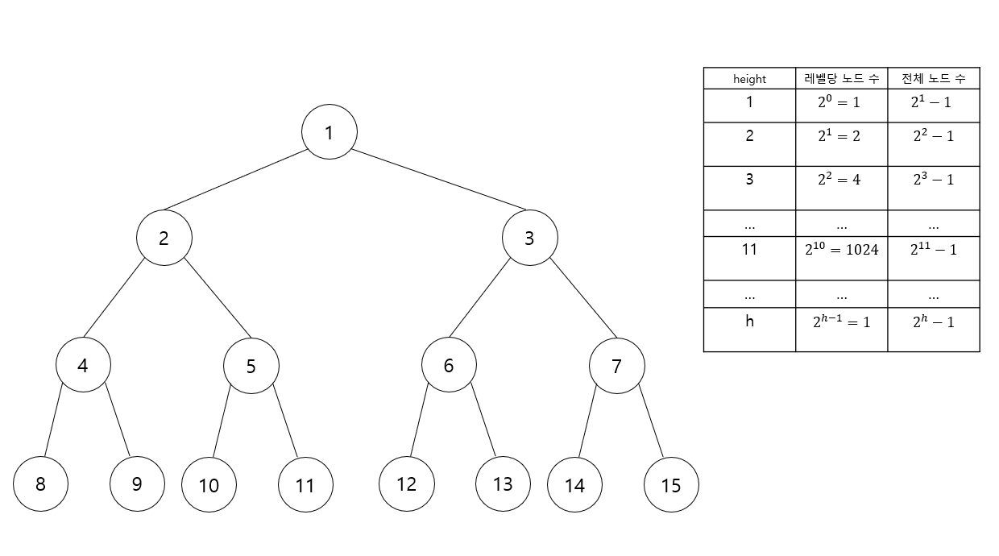

- Level i 의 노드 갯수:  $2^{i-1}$

- Depth k 일때 트리의 총 노드 갯수: $ 2^k-1$


=> n개 노드의 전체 이진 트리의 깊이는 $\theta(\log n)$입니다.
트리를 사용하는 많은 작업에는 트리 내 일부 경로의 깊이와 일치하는 실행 시간이 있습니다. 만약 완전한 이진 트리(또는 그와 비슷한 트리)가 있다면, 우리는 그러한 작업이  $O(\log n)$에서 실행된다는 것을 다음의 증명으로 알수 있습니다.

$ n = 2^k - 1 \\\ n+1 = 2^k \\\ \log_2(n+1) = \log_2(2^k) \\\ \log_2(n+1) = k \\\ \theta(\log n) = k \\\ O(\log n) \\\ $


### Complete Binary Tree

마지막 레벨을 제외한 모든 레벨의 node가 완전히 채워져 있으며 마지막 레벨의 node들은 가능한 한 왼쪽부터 채워져 있는 구조


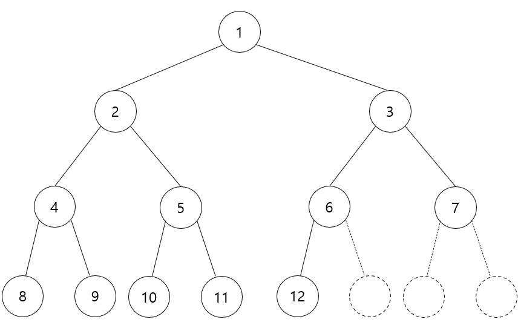

- n개의 노드를 가진 완전 이진 트리의 높이: $ \lceil \log_2 (n+1) \rceil, \  \lceil x \rceil \ is \ the \ smallest \ integer \ \geq x $


Proof)

$ n = 2^k-1 \ (for \ k \geq 1) \\\ 2^k = n+1 \\\ \log_2(2^k) = \log_2(n+1) \\\ k = \log_2(n+1) \\\ k = \lceil \log_2(n+1) \rceil \\\ $


### Binary search Tree

 **Symmetric order**를 가진 **binary tree**

- **Binary Tree**: 노드로 구성되며, 각 노드는 최대 두 개의 자식(왼쪽과 오른쪽 자식)을 가진다.

- **Symmetric Order**

  - 모든 노드는 키를 갖는다. 

  - 모든 노드의 키는
    - 왼쪽 하위 트리의 모든 키보다 크다.
    - 오른쪽 하위 트리의 모든 키보다 작음

  - 중복된 키의 노드가 없어야 한다.


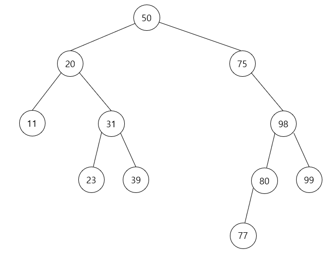


### 트리 순회

체계적인 방식으로 트리의 각 노드를 정확히 한 번 방문하는 프로세스를 나타냅니다.

L과 R에 대한 V(방문 노드)의 위치 때문에 LVR(inorder), LRV(postorder) 및 VLR(preorder)이라고 부릅니다.


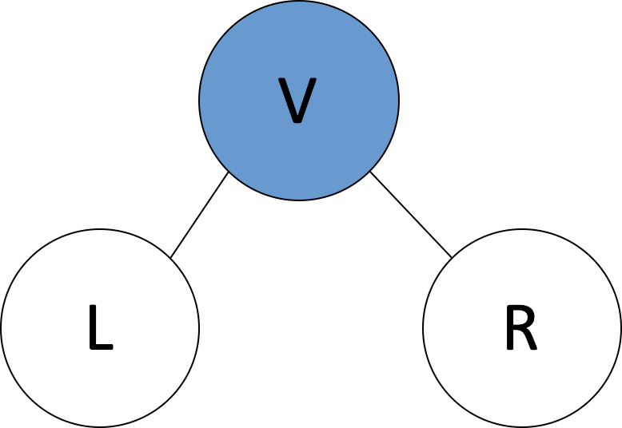


#### LVR (inorder)

1. 왼쪽 서브 트리를 순회
2. 서브 트리의 루트를 방문 (printf)
3. 오른쪽 서브 트리를 순회

```c
void inorder(pTree ptr) {
	if (ptr) {
		inorder(ptr->left); // left L
		printf("%c", ptr->item); // visit V
		inorder(ptr->right); // right R
	}
}
```

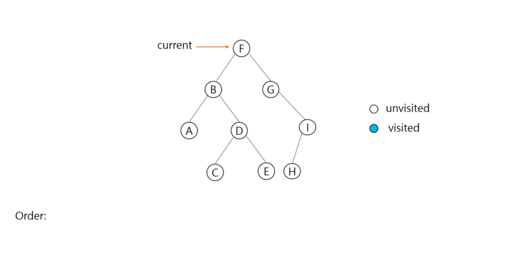

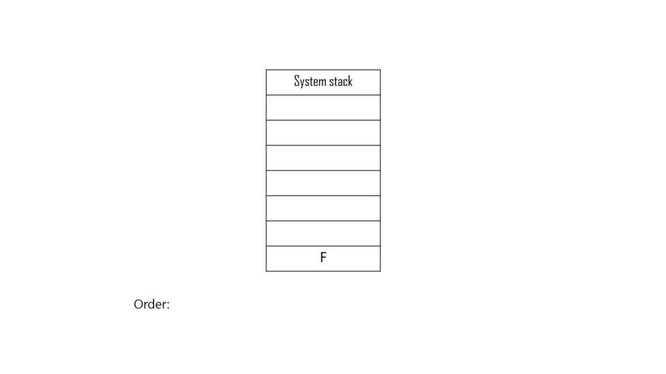

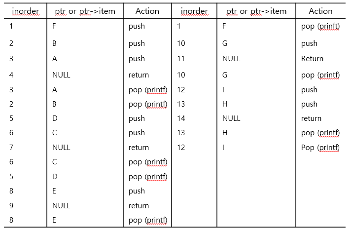


**스택을 사용한 inorder 탐색 (재귀 X)**

1. 빈 스택 S를 선언한다.
2. 탐색을 시작할 노드를 설정한다.
3. S에 노드를 push하고 노드가 NULL이 될 때까지 `node = node->left`
4. 노드가 NULL이고 스택이 비어 있지 않으면
   1. 스택에서 상단 항목을 pop한다.
   2. pop한 노드의 node->item을 출력하고 `node = node->right`
   3. 3단계로 이동.

5. 노드가 NULL이고 스택이 비어 있으면 완료

```c
void iterativeInorder(pTree node) { // node to start
    int top = -1; // initialize stack
    pTree stack[MAX_STACK_SIZE];// get a stack
    for (;;) {
        for (; node; node = node->left)
            push(node);
        
        node = pop();
        if (!node) break;
        printf("%d", node->item);
        node = node->right;
    }
}
```


#### LRV  (postorder)

1. 왼쪽 서브 트리를 순회
2. 오른쪽 서브 트리를 순회
3. 서브 트리의 루트를 방문 (printf)

```c
void postorder (pTree ptr) {
    postorder(ptr->left);
    postorder(ptr->right);
    printf("%c", ptr->item);
}
```

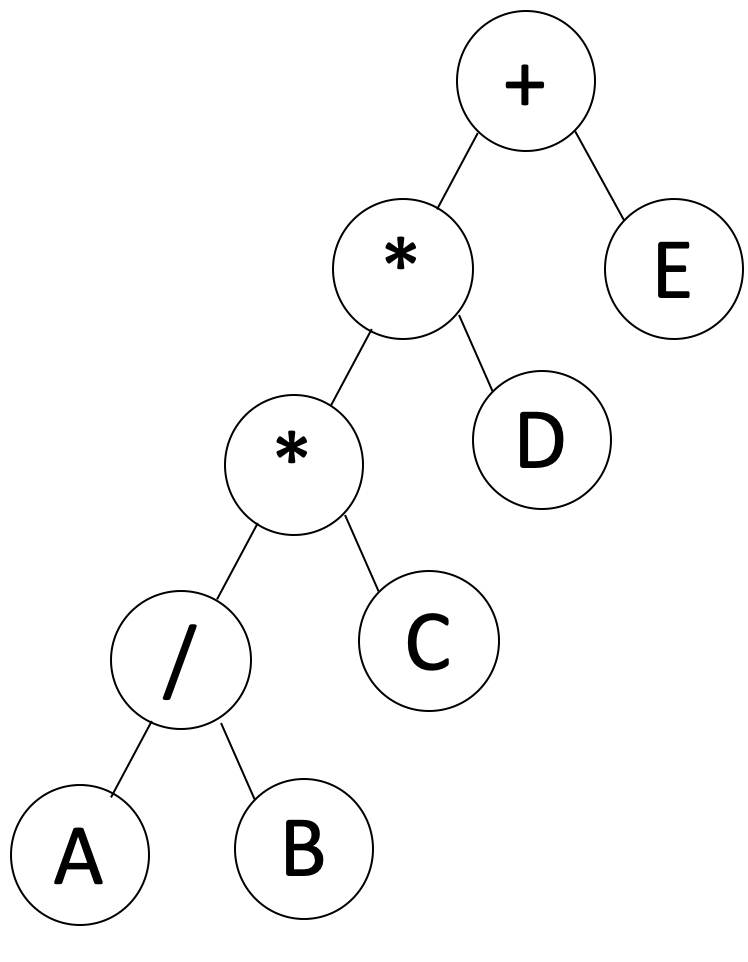

Output(LVR): `A B / C * D * E +`


#### VLR (preorder)

1. 서브 트리의 루트를 방문 (printf)
2. 왼쪽 서브 트리를 순회
3. 오른쪽 서브 트리를 순회

```c
void preorder (pTree ptr) {
    printf("%c", ptr->item);
    preorder(ptr->left);
    preorder(ptr->right);
}
```

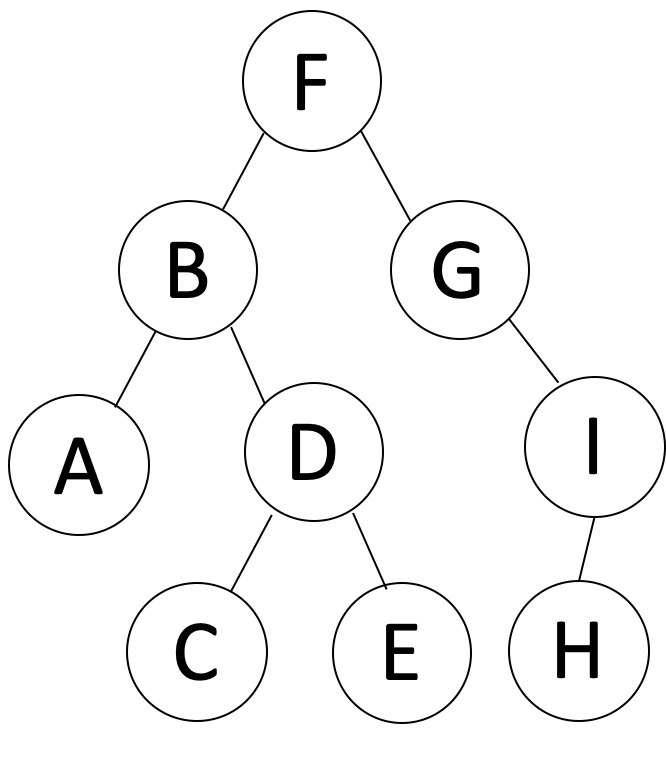


Output(VLR): `F B A D C E G I H`


**결론**

1. 다른 leaf들을 검사하기 전에 루트를 방문해야 한다는 것을 알고 있다면 pre-order (VLR) 방식을 선택합니다. 
2. 다른 노드보다 먼저 leaf들을 탐색해야한다는 것을 알고 있다면 post-order (LRV) 을 선택합니다. 
3. 그 외의 경우  in-order(LVR) 를 사용해야 합니다.


#### BFS (level-order)

레벨 순서대로 노드를 방문합니다.

1. 루트를 먼저 방문합니다.
2. 루트의 왼쪽 자식 노드를 방문하고 오른쪽 자식 노드를 방문합니다.
3. 가장 왼쪽에 있는 노드에서 가장 오른쪽에 있는 노드까지 레벨별로 방문합니다


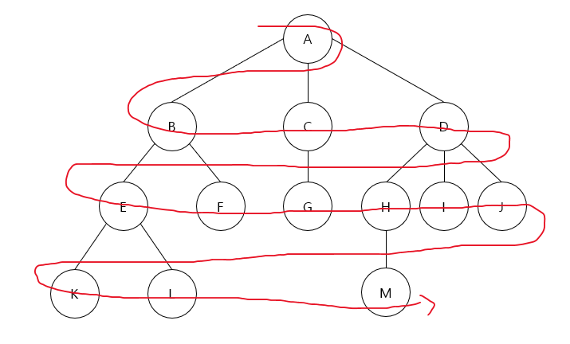

BFS는 그래프 단원에서 다룹니다.
