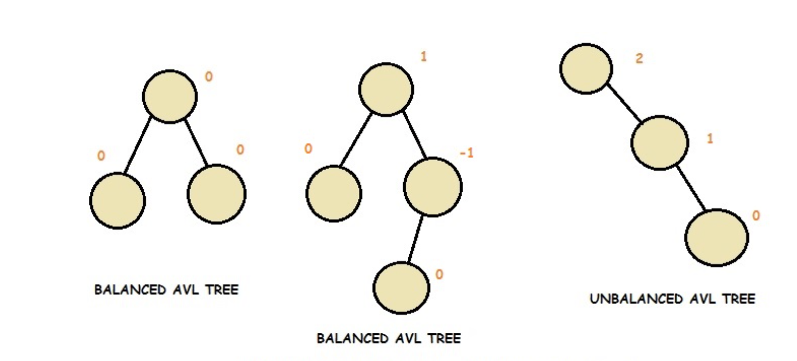
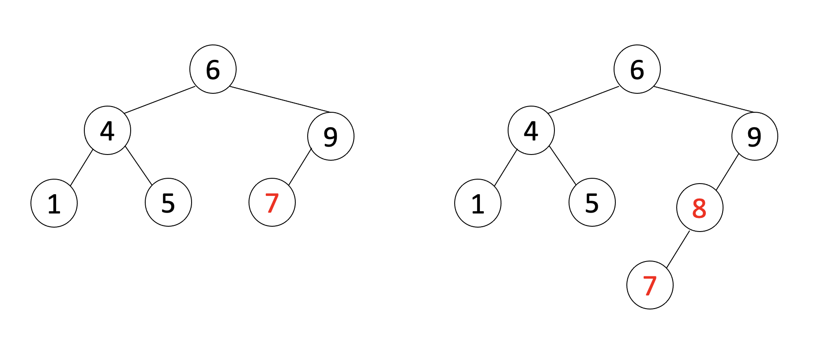
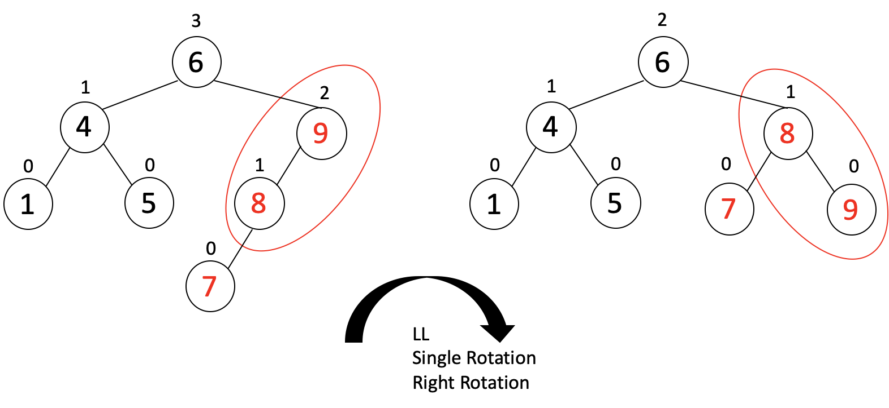
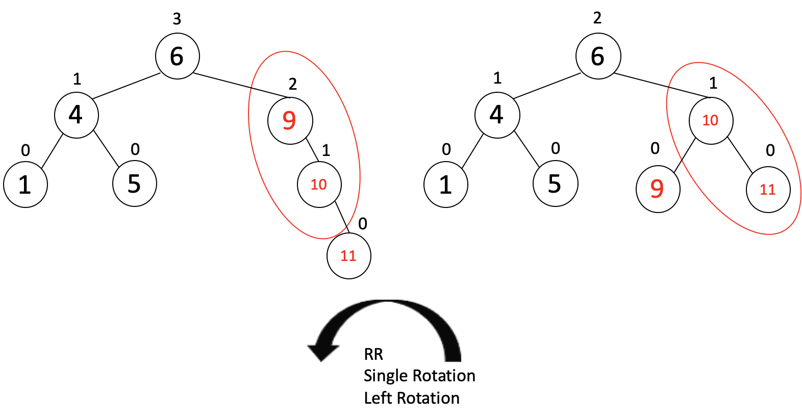
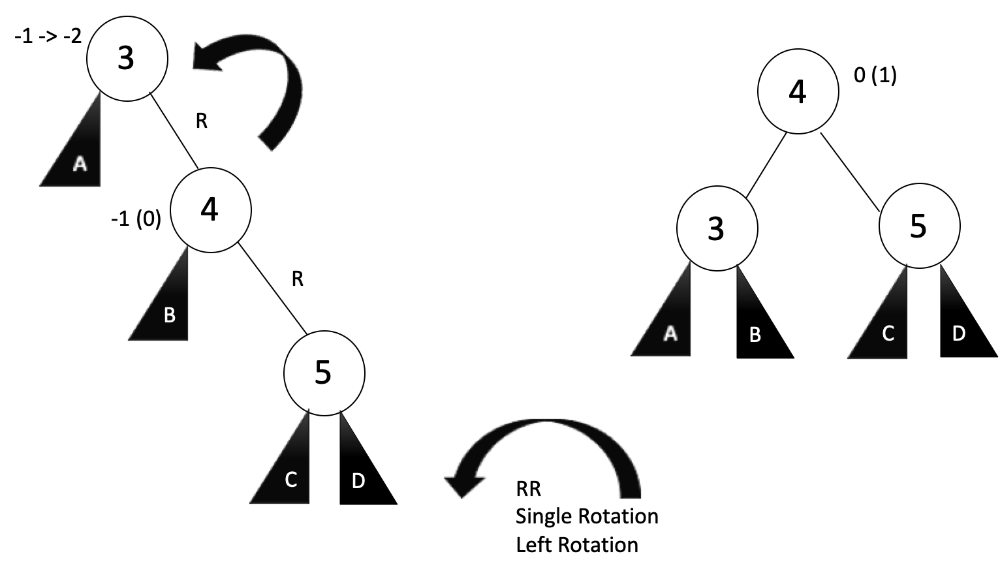
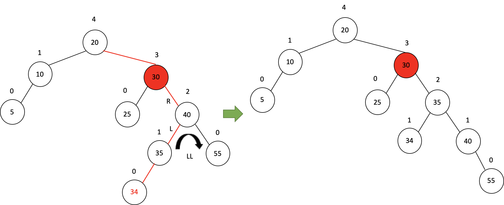
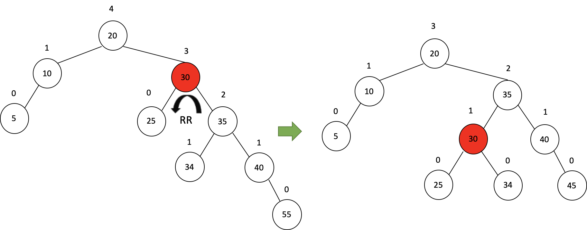
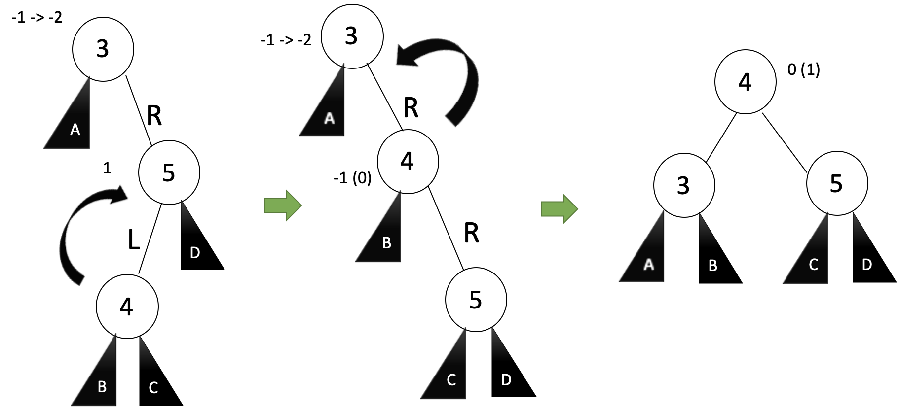
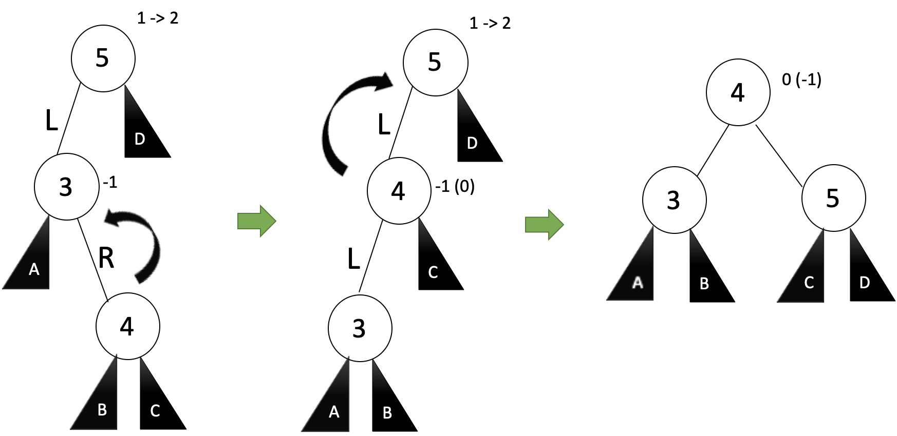

Adelson-Velskii and Landis의 앞 글자를 따서 AVL트리라고 부른다.

<br>


모든 BST 연산의 시간복잡도는 $ O(d), \ d = height\  of \ tree  $ 입니다.

$ d = \lfloor \log_2 N \rfloor,\ N = total\ node\ number $ 

- best case: $ O(\log N) $

  Balanced: 노드 수가 N일 때 최대 logN height를 갖는다.

- worst case: $ O(N) $

  Unbalanced: 노드 수가 N일 때 N에 가까운 height를 갖는다.


시간 복잡도의 차이가 나는 이유는 트리의 높이인데, 같은 노드의 개수의 트리라도  높이가 다를 수 있습니다.



3번째 트리처럼 노드가 3개뿐이지만 높이가 3인 트리를 **균형이 맞지 않는 트리 (unbalanced tree)**라고 합니다.


트리의 불균형을 최소화하기 위해 고안된 알고리즘 혹은 모델은 매우 많습니다.

- **AVL tree**
- **Weight-balanced trees**
- **Red-black trees**
- **Splay trees and other self-adjusting trees**
- **B-trees**


### AVL 트리

모든 노드에 대해 왼쪽 및 오른쪽 하위 **트리의 높이의 차이(balance factor)**의 절대값이 1 이하인 BST를 AVL트리라고 합니다.


$ height \ of \ node = h $

$ balance \ factor = h_{left} - h_{right} $

$ empty \ height = -1 $


#### **구조**

```c++
struct node {
  int balance;
  int key;
  node left, right;
} node;
```

 


#### 기본 메소드

```c++
bool isAVL(tree t);					// returns true if AVL Tree
bool _isAVL(tree t);				// helper function for isAVL()

bool balanced(tree t);				// checks the balance factor 
int balanceFactor(tree t);			// height diff(left - right)
```


**bool balanced(tree node)**

균형계수의 절대값이 2 미만이면 `true`를 반환합니다.

```c++
bool balanced(tree node) {
	int factor = balanceFactor(node);
	return (factor >= -1 && factor <= 1) ? true : false;
}
```


**int balanceFactor(tree node)**

```c++
// returns the balance factor or (height of left - height of right)
int balanceFactor(tree node) {
	DPRINT(cout << " bf" << endl;);
	if (empty(node)) return 0;

	int left = height(node->left);
	int right = height(node->right);
	return left - right;
}
```


**bool isAVL(tree root)**

```c++
// returns true if the tree is AVL tree.
// this is a helper function for isAVL().
bool _isAVL(tree root) {
	if (!balanced(root)) return false;
	if (root->left != nullptr && !_isAVL(root->left))  return false;
	if (root->right != nullptr && !_isAVL(root->right)) return false;
	return true;
}
bool isAVL(tree root) {
	if (empty(root)) return true;
	if (!isBST(root)) return false;
	return _isAVL(root);
}
```


#### **Balancing**

```c++
tree rotateLL(tree A);
tree rotateRR(tree A);
tree rotateLR(tree A);  
tree rotateRL(tree A);
tree rebalance(tree node);
```

balance 변수의 절댓값이 1을 초과하는 순간 balancing을 실행하게 됩니다.

대부분 노드를 새로 추가할 때 균형이 깨지면서 balancing이 필요합니다.

- 일부 노드의 경우 균형 계수가 2 또는 -2가 될 수 있습니다.
- Insert 후 노드별로 루트 노드로 돌아가서 높이를 업데이트합니다.
- 새로운 균형 계수 ($ h_{left} - h_{right} $ 차이)가 2 또는 -2인 경우 노드를 중심으로 회전하여 트리를 조정합니다.


##### i. LL rotation

**Example 7, 8을 추가했을 때**



**Left tree**에 7 추가

**Left tree**에 8 추가 => LL case라고 부릅니다.




또한 node 9를 기준으로 balanceFactor = 2이므로 오른쪽으로 트리를 회전시킵니다.


Right Rotation은 아래와 같습니다.

- 번호가 매겨진 원: 재조정 중인 노드.
- 글자가 있는 삼각형: 그 자체가 균형 AVL 트리인 하위 트리를 나타냅니다.
- 노드 옆의 숫자: Balance Factor. (괄호 안은 삭제 시에만 발생).


```c++
tree rotateLL(tree A) { 
	cout << "\t[LL]case at " << A->key << endl;
	tree B = A->left;
	A->left = B->right;
	B->right = A;
	return B;
}
```


##### ii. RR rotation

노드 10, 11을 추가 했을 때

노드 9의 **Right tree**에 10 추가

노드 10의 **Right tree**에 11 추가 => RR case라고 부릅니다.

또한 node 9를 기준으로 balanceFactor = -2이므로 왼쪽으로 트리를 회전시킵니다.






```c++
tree rotateRR(tree A) {
	cout << "\t[RR]case at " << A->key << endl;
	
	tree B = A->right;
	A->right = B->left;
	B->left = A;
	return B;
}
```


##### iii. RL rotation: LL + RR


노드 34을 추가 했을 때

노드 30의 **Right tree**인 40,

노드 40의 **Right tree**인 35 밑에 삽입되었으므로 RL rotation라고 부른다.


또한 노드 30를 기준으로 balanceFactor = 2이므로 왼쪽으로 트리를 회전시킵니다.




회전 한 후 노드 30을 기준으로 balanceFactor = -2이므로 오른쪽으로 트리를 회전시킵니다.







```c++
tree rotateRL(tree A) {
	cout << "\t[RL]case at " << A->key << endl;
	tree B = A->right;
	A->right = rotateLL(B);
	return rotateRR(A);
}
```


##### iv. LR rotation: RR + LL

노드 34을 추가 했을 때

노드 30의 **Right tree**인 40,

노드 40의 **Right tree**인 35 밑에 삽입되었으므로 RL rotation라고 부른다.


그림추가





종합하자면, 재조정이 필요한 노드를 a라고 할 때 4가지 경우가 있습니다.


**외부 케이스(1회전 필요):**

1. a의 왼쪽 자식의 왼쪽 하위 트리에 삽입. (LL)
2. a의 오른쪽 자식의 오른쪽 서브트리에 삽입. (RR)


**내부 케이스(이중 회전 필요):**

1. a의 왼쪽 자식의 오른쪽 서브트리에 삽입. (LR)
2. a의 오른쪽 자식의 왼쪽 하위 트리에 삽입. (RL)


재조정은 4개의 개별 회전 알고리즘을 통해 수행됩니다.


#### 구현

```c
struct node {
  int balance;
  int key;
  node left, right;
} node;


int getHeight(node node) {
  if (node == NULL) return 0;
  int left = leftHeight (node->left);
  int right = rightHeight (node->right);
  return (left > right) ? left + 1 : right + 1;
}

int balanceFactor (node node) {
  if (node == NULL) return 0;
  int left = leftHeight (node->left);
  int right = rightHeight (node->right);
  return left - right;
}

node rotateLL (node A) {
  node B = ;
  A->left = ;
  B->right = ;
  return ;
}

node rotateRR (node A) {
  node B = ;
  A->left = ;
  B->right = ;
  return ;
}


node rotataLR (node A) { // RR and LL 
  node B = ;
  A->left = rotateRR( );
  return rotateLL ( );
  
}

node rotateRL (node A) { // LL and RR
  node B = A->right;
  A->right = rotateLL( );
  return rotateRR( ) ;
}


node rebalance (node node) {
  int bf = balanceFactor(node);
  
  if (bf >=2) {
    if (balanceFactor(node->left) >= 1) node = rotateLL(node); // LL, outside case
    else node = rotateLR(node); 	// LR, inside case
  }
  
  else if (bf <= -2) {
    if (balanceFactor(node->right) <= -1) node = rotateRR(node);
    else node = rotateRL(node);
  }
  
  return node;
}
```


#### 트리의 높이와 시간복잡도

$ N(h) $: h의 높이를 가진 AVL 트리의 최소 노드 갯수

- $ N(0) = 1, \ \ N(1) = 2 $
- $ N(h) = N(h-1)+N(h-2) + 1 $
- $ N(h) \geq \phi^h (\phi \approx 1.62 ) $


$ n \geq N(h) \\\ n \geq \phi^h \\\ \log_{\phi} n \geq h \\\ h \leq 1.44\log_2n $

따라서 검색은 $ O(\log n) $ 시간 안에 가능하다.

